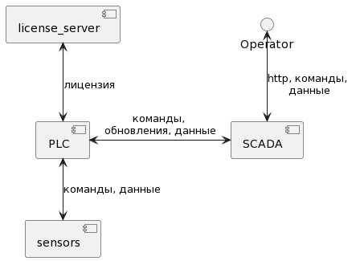
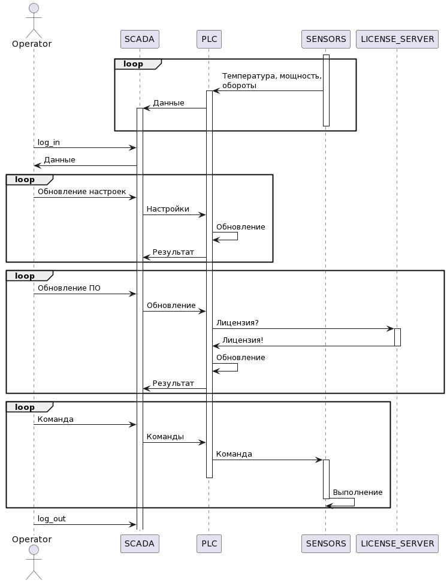

# Настройка и запуск

### Системные требования

Данный пример разработан и проверен на ОС Ubuntu 20.04.5, авторы предполагают, что без каких-либо изменений этот код может работать на любых Debian-подобных OS, для других Linux систем, а также для MAC OS необходимо использовать другой менеджер пакетов. В Windows необходимо самостоятельно установить необходимое ПО или воспользоваться виртуальной машиной с Ubuntu (также можно использовать WSL версии не ниже 2).

### Используемое ПО

Стандартный способ запуска демо предполагает наличие установленного пакета *docker*, а также *docker-compose*. Для автоматизации типовых операций используется утилита *make*, хотя можно обойтись и без неё, вручную выполняя соответствующие команды из файла Makefile в командной строке.

Другое используемое ПО (в Ubuntu будет установлено автоматически, см. следующий раздел):
- python (желательно версия не ниже 3.8)
- pipenv (для виртуальных окружений python)

Для работы с кодом примера рекомендуется использовать VS Code или PyCharm.

В случае использования VS Code следует установить расширения
- REST client
- Docker
- Python

### Настройка окружения и запуск примера

Подразумевается наличие развернутой по предоставленному образцу машины с установленным и настроенным ПО, например, docker и docker-compose, с выбранным интерпретатором.

Для запуска примера рекомендуется использовать следующую комбинацию команд в терминалах 1 и 2:

1.1 docker-compose build --force-rm

1.2 make run (В устройстве начнут генерироваться и поступать сигналы от эмуляторов датчиков)

2.1 docker-compose logs -f --tail 100 (будет показан лог работы контейнеров)

1.3 make test (Будет запущен тестовый сценарий проверки работы основного функционала системы)

__Можно пользоваться запросами из request.rest__

1.4 docker stop $(docker ps -q) (завершение работы, альтернативно можно воспользоваться командами "turn_off" к "датчикам" через запросы в request.rest)

### Описание системы

Система архитектруно выглядит следующим образом:

//www.plantuml.com/plantuml/png/SoWkIImgAStDuV8lI2rABCalKh3HrRLJY0vsTdHnZ5MmKiWeAIdGKRYmwyA-2tikRBYmzyAMYzqw2Z5v5xQ0UNilTb_OoXKTuECSgs23q6Y5HGUGl_72NY2vwSBk2rk1h1qN-tKKi9fJMW0oAYSpEJMlE3M-EBMeBBK8PEPke9usiDxj8DrmzIdvvNaW7SL0zVb5nHZMerdZa9gN0lGp0000

### Компоненты

| Название | Назначение | Комментарий |
|----|----|----|
|*scada* | Эмулятор системы контроля и управления станции. Здесь - входная точка системы, которая принимает команды и запросы от оператора, позволяет авторизоваться и выдает подписанным пользователям данные, полученные от ПЛК. | - |
|*license_server* | Эмулятор сервиса, который проверяет возможность выполнения запрошенного действия (здесь - обновления) для заданного устройства и оператора. | - |
|*plc* | Непосредственно ПЛК, получает команды от операторов, выполняет их, обновляется по команде, принимает данные от датчиков (sensors), обрабатывает и передает их на СКАДУ. | - |
|*sensors*  | Эмулятор датчиков, здесь их 3 - датчик температуры, мощности и количества оборотов турбины. Получают команды (старт/стоп/изменить пределы генерации), генерируют непосредственно данные раз в заданный промежуток времени и отдают их на ПЛК через HTTP. | Пределы генерации можно изменить через команды. (Команда -> scada -> plc -> sensors). Пример есть в тесте. |
|*storage* | Фактически это лишь папка с данными. Здесь она для простоты используется и scada и plc, хотя очевидно, что это разная память. Для подчеркивания разницы используются постфиксы _plc и _scada в названии файла. Файл version подразумевает "обновление", settings - настройки системы, используемые для сравнения в plc входных данных. Здесь же файл users - список ролей в системе и связанных с ними логинов и паролей. | Роли: Наблюдатель - может получать только данные. Оператор - может получать данные и менять настройки. Инженер - может обновлять ПО. |

Диаграмма последовательности выглядит следующим образом:

[Cсылка на диаграмму для редактирования](//www.plantuml.com/plantuml/png/jPFFIiD04CRl-nJhkSqB5D6MceDGh3JWIIXB6YGGio59xzg282q8uacnYa-GYg6rVz9Nc7qZPxTDx1OHB-RGJURxpUmtkzDg5BCmxbvwX30xvY5TFyt02PdyP17b9434jTs0-J6rwhMZcWn7DkimJJfjrAKGU3RHKymJgzcoL9BZHpoCDBbnN4V0R5jcwyniISfpRUGSGZpE0xB9APK8LgRx1Yq25GflaC82Lf2AAqX4J_JbMgOOoyGjBF7t6gF3yhaF6OmXGpd3m43LCWxMNQXA3v0WlnG3IFCj3OCuVeSGNf0Lwl6BjkiJzIN3N4zLbhK46C5O6e5tc4EARrD8AIw9SePsC3ZxheU-CETvI_w46KnplxZyN59h295N52QY3tCn53rvDBALlxfxWP7kwBSjy-jIf_W4Kt6ZW0c-tHsIZLWKsYNsSi8m_gt7HoopK7Vq0OdUc2OMOw6Dc9wD03hTw5ieWlSu02k4vuZcZlL9sXqates9VAeeud_m2m00)

## Примечания

В данном примере не используется брокер сообщений, взаимодействие между системами построено на базе REST запросов, однако в решении _внутренние_ компоненты проектируемого устройства должны взаимодействовать через брокер сообщений (желательно Apache Kafka), _внешнее_ взаимодействие следует по-прежнему через REST. 

Пример такой реализации можно найти в репозитории https://github.com/sergey-sobolev/secure-update, подробное описание запуска примера есть на степике (https://stepik.org/course/133991/)

Хотя код этого примера написан на Python, команды могут по желанию своё решение сделать на других языках (C/C++, C#, Golang, Javascript/Typescript, Java, Rust, PHP), основные требования:
1. использование брокера сообщений (предпочтительно Apache Kafka, но можно RabbitMQ, Mosquitto)
2. наличие хотя бы одного функционального теста
3. наличие тестов безопасности (предпочтительно автоматизированных, в крайнем случае - описание ручных тестов безопасности)
4. наличие монитора безопасности, который должен контролировать все взаимодействия между доменами безопасности
5. наличие политик безопасности, которые использует монитор безопасности. Политики безопасности должны обеспечивать реализацию предложенной политики архитектуры.

## Дополнительные материалы по кибериммунной разработке

- Видео на youtube (записи занятий)
  - Теория https://youtu.be/hTDBLP1Jlc0 
  - Разбор домашнего задания на проектирование; ключевые принципы и технологии работы кибериммунных систем https://youtu.be/eYr-toUUQDA
  - Пошаговый разбор трансформации примера в новую систему https://youtu.be/BH2HrPltr7M
  - Тестирование, в т.ч. тесты безопасности https://youtu.be/BEVZVm6xi-M 
- Github wiki по теме со ссылками на примеры и решения на Python и Java https://github.com/sergey-sobolev/cyberimmune-systems/wiki/%D0%9A%D0%B8%D0%B1%D0%B5%D1%80%D0%B8%D0%BC%D0%BC%D1%83%D0%BD%D0%B8%D1%82%D0%B5%D1%82
- Заготовка описания решения команды https://github.com/sergey-sobolev/secure-update/blob/main/docs/report/report.md
