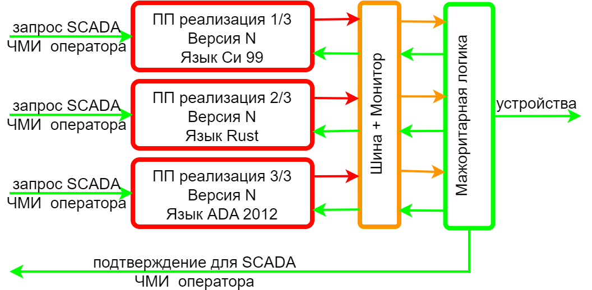
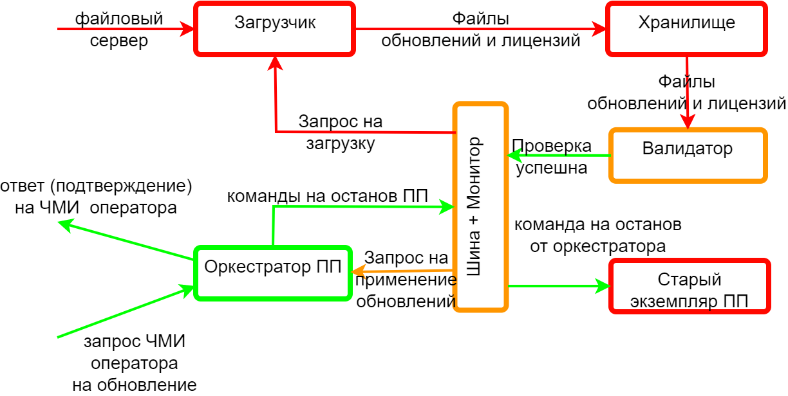

# Отчёт о выполнении задачи "NAME"

- [Отчёт о выполнении задачи "NAME"](#отчёт-о-выполнении-задачи-name)
  - [Постановка задачи](#постановка-задачи)
  - [Известные ограничения и вводные условия](#известные-ограничения-и-вводные-условия)
    - [Цели и Предположения Безопасности (ЦПБ)](#цели-и-предположения-безопасности-цпб)
  - [Архитектура системы](#архитектура-системы)
    - [Компоненты](#компоненты)
      - [Прикладное ПО. Развёрнутый комментарий](#прикладное-по-развёрнутый-комментарий)
    - [Алгоритм работы решения](#алгоритм-работы-решения)
    - [Описание Сценариев (последовательности выполнения операций), при которых ЦБ нарушаются](#описание-сценариев-последовательности-выполнения-операций-при-которых-цб-нарушаются)
    - [Указание "доверенных компонент" на архитектурной диаграмме.](#указание-доверенных-компонент-на-архитектурной-диаграмме)
    - [Политики безопасности](#политики-безопасности)
  - [Запуск приложения и тестов](#запуск-приложения-и-тестов)
    - [Запуск приложения](#запуск-приложения)
    - [Запуск тестов](#запуск-тестов)

## Постановка задачи


## Известные ограничения и вводные условия


### Цели и Предположения Безопасности (ЦПБ)
Цели безопасности:


Предположения безопасности:


## Архитектура системы

### Компоненты

| Название | Назначение | Комментарий |
|----|----|----|
| *Валидатор* |<ul><li>контроль целостности файлов ПП и обновлений ПП,</li><li>контроль целостности файлов настроек и обновлений настроек,</li><li>выдачу на шину подтверждения, что файлы проверены и их можно использовать в работе.</ul>| **Доверенный компонент**. В рамках условности прототипа валидатор и оркестратор объединены в единый модуль|
| *Оркестратор ПП* | <ul><li>контроль целостности виртуальной памяти запущенных процессов ПП,</li><li>контроль собственной целостности в виртуальной памяти и на диске,</li><li>запуск новых версий прикладного ПО после подтверждения от компонента "Валидатор",</li><li>организацию пула нескольких одновременно работающих версий ПП, каждая из которых представлена тремя различающимися экземплярами для работы по мажоритарной логике (triple voting),</li><li>"бесшовный" запуск новых версий и останов старых, при котором гарантируется, что в каждый момент времени одновременно работает как минимум 2 версии и по 3 экземпляра ПП,</ul>| **Доверенный компонент**. В рамках условности прототипа валидатор и оркестратор объединены в единый модуль |
| *Мажоритарная логика* | <ul><li>сравнение параметров телеметрии, выдаваемых экземплярами ПП, по мажоритарному принципу, принятие решения о целостности данных и выдача на SCADA или ЧПИ оператора,</li><li>сравнение команд управления устройствами (включая защиту), сформированных экземплярами ПП, принятие решения о целостности данных по мажоритарному принципу и передача на устройство, с подтверждением в SCADA и ЧМИ оператора</li></ul>| **Доверенный компонент** |
| *Интерфейс датчиков* |<ul><li>выдача показаний датчиков в SCADA по REST,</li><li>выдача показаний датчиков в ПП по шине (с соответствующим контролем монитора).</li></ul>| **Доверенный компонент** |
| *Монитор безопасности* | //TODO описать | **Доверенный компонент** |
| *Прикладное ПО* | <ul><li>регулярный приём показаний датчиков из компонента "Интерфейс датчиков" и автоматическое управление подключенным оборудованием (срабатывание защиты)</li><li>выдачу по запросу SCADA показаний датчиков, предварительно обрботанных по заданному алгоритму (для получения непосредственных показаний без обработки следует обащаться со SCADA напрямую к доверенному компоненту "интерфейс датчиков") </ul> | **Недоверенный компонент** по причинам использования сторонних компонентов и библиотек, большого объёма кода, который сложно контролировать, и возможного вовлечения сторонних подрядчиков.|

#### Прикладное ПО. Развёрнутый комментарий
Каждый экземпляр прикладного ПО представлен набором из как минимум трёх одновременно работающих модулей. Каждый модуль реализует один и тот же функционал и одни и те же алгоритмы управления и обработки показаний датчиков. Выходные сигналы от каждого экземпляра обрабатываются доверенным компонентом "Мажоритарная логика". 


Для снижения верятности одновременного отказа или компрометации, экземпляры ПП должны быть
* разработаны различными подрядчиками или командами разработчиков,
* разработаны на различающемся технологическом стеке (разные языки, версии языков, библиотеки),
* собраны на различных машинах.

### Алгоритм работы решения


### Описание Сценариев (последовательности выполнения операций), при которых ЦБ нарушаются


**Отдельная диаграмма для первого негативного сценария - NAME1:**


**Отдельная диаграмма для второго негативного сценария - NAME2:**


### Указание "доверенных компонент" на архитектурной диаграмме.

Обобщённая диаграмма архитектуры
<!-- TODO -->
На данном рисунке указаны, ввиду общей сложности, только  связи с внешними элементами системы (SCADA, ЧМИ оператора, датчики, исполнительные устройства), а цветами обозначены доверенные и недоверенные компоненты. Более детальную схему, с внутренними связями выделением компонентов, повышающих целостность данных, имеет смысл описывать для различных потоков данных:

| | |
|----|----|
| Выдача команд исполнительным устройствам с ПП (автоматика) и команд оператора | Получение простой информации непосредственно с датчиков в ПП и SCADA |
|  |  |
| Получение информации с датчиков, требующей обработки на устройстве | Обновление ПП |
|  |  |
| Обновление настроек | Обновление лицензии |
|  | //TODO |


### Политики безопасности 


```python {lineNo:true}

```

## Запуск приложения и тестов

### Запуск приложения

см. [инструкцию по запуску](README.md)

### Запуск тестов

_Предполагается, что в ходе подготовки рабочего места все системные пакеты были установлены._

Запуск примера: открыть окно терминала в Visual Studio code, в папке с исходным кодом выполнить 

**make run**
или **docker-compose up -d**

запуск тестов:
**make test**
или **pipenv run pytest**
